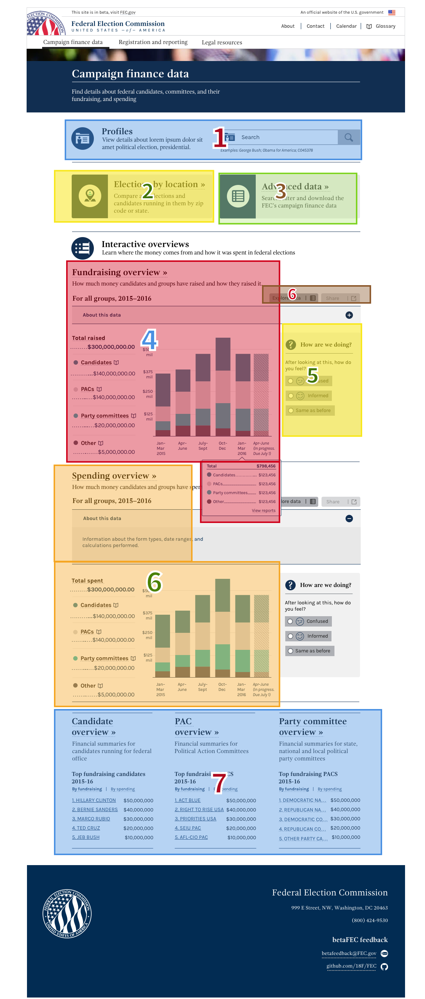

# Dashboard

 _this feature is currently being designed_ _for full report, see [Dashboard Research Summary](../directional_research/dashboard_summary.md)_

## Initial Directional Research Summary

In developing the first public release of beta.fec.gov, we uncovered that there was a lot of terminology and rules affecting the comprehension of folks relatively new to campaign finance. Through a research sprint targeting this, we uncovered the following high level goals for novice users:

- A way to get an introduction to the world of campaign finance and a sense of the information available on the site
- A way to get a quick look at key high-level facts
- An easy way to explore high-level data that allows and encourages easy connections and flows into the underlying data set
- A means of exploring the high-level data that prompts further exploration, piques curiosity and inspires questions and ideas
- An easy path to explore campaign finance information at the "right level" for the user-- both novice/high level, as well as advanced/detailed data

From this, two mock-ups were created for concept testing, representing two possible flows and interaction concepts: [flow A](https://gsa.invisionapp.com/share/UP70ZUQFD#/screens), [flow B](https://gsa.invisionapp.com/share/UP70ZUQFD#/screens/152282020).

## Spending & Fundraising Overview {4, 6}

feature                                            | issues | last tested                                                                    | gif/pic | test notes
:------------------------------------------------- | :----- | :----------------------------------------------------------------------------- | :------ | :---------
[1596](https://github.com/18F/openFEC/issues/1596) |        | see [dashboard research summary](../directional_research/dashboard_summary.md) |         |
[322](https://github.com/18F/fec-style/issues/322) |        | not yet tested                                                                 |

## Engagement Widget {5}

feature                                            | issues | last tested    | gif/pic | test notes
:------------------------------------------------- | :----- | :------------- | :------ | :---------
[1596](https://github.com/18F/openFEC/issues/1596) |        | not yet tested |
