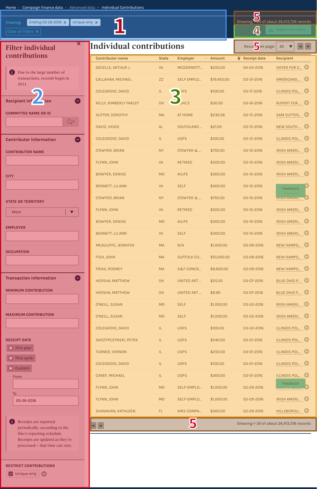

# Advanced Data Tables

These tables are meant to provide expert users with the ability to browse and filter candidates, committee, receipts and disbursements, filtering by a range of dimensions. Meant for more advanced users.

## key:

:red_circle:           | Relatively severe, insurmountable experience issue, failures endemic. Recommend that action is taken (`red_circle`)
:--------------------- | :-------------------------------------------------------------------------------------------------------------------------------------------------------------------------------------------------------------------------------------------------------------------------------------------------------------------------------------------------------------------------------------------------------------------------------------------------------------------------------------------------------------------------------------
:large_orange_diamond: | Moderate experience issue; reasons for failure or success are complicated, inconsistent and/or may be addressed by other fixes (`large_orange_diamond`)
:white_circle:         | Minor or nonexistent experience issue, or unclear finding, no action indicated (`white_circle`)
decision bullet format | `- [needs action indicator]` Problem: "Users thought this happened, or expected this, when really this" then if :red_circle: :wrench: Fix/hypothesis statement: "we think that by making this X do Y, it will improve" or if :large_orange_diamond: Why to address this later (any dependent issues or pre-fix fixes) or if :white_circle: The thing we were looking for in testing / Recap of why no action : Inconclusive test / Not enough data / Good enough!`[Assigned in GitHub issue #]` `[tested date link]` `[demo gif link]`

## Filtering and searching :two:, :five:

### Filtering and the filter panel

- :large_orange_diamond: Problem: Two users recognized what the number in parentheses on the top of the filter panel meant immediately (that is, the number of active filters), but two others thought that maybe it meant that there were three different filters to select. [tested 8/4/2016](https://github.com/18F/FEC/blob/master/test_scripts/2016-08-04.md)

  - :wrench: Users who were successful in identifying what the numeral meant also interpreted what the filters were. Some users had difficulty, but the feature does not acutely get in the way of their operation of the website, and it may be learnable.  

- :white_circle:Users were able to find and use the filter panel. [tested 8/4/2016](https://github.com/18F/FEC/blob/master/test_scripts/2016-08-04.md)

- :white_circle: The revised loading and success states improved the filtering experience, raising no issues for participants. [tested 8/4/2016]([https://github.com/18F/FEC/blob/master/test_scripts/2016-08-04.md)

- :white_circle: Problem: One user expected to see an employer column in a table where they could filter by employer. While another user searched for employer in the committee filter. They may not have trusted the results because the context of what they were searching for was not there. [tested 8/4/2016]([https://github.com/18F/FEC/blob/master/test_scripts/2016-08-04.md)
  - :wrench: As this was not the focus of the test, the problem and the fix are not completely clear at this point, and further testing of the structure of data tables and their interrelation is likely called for. Might be useful to test further, test specific filters for specific data sets to observe if some additional users continue to select the wrong filters. Unclear the source of the confusion, born of language or wording, or the appearance of the committee name field when page loaded. Confusion might be around which filters are shown and where they’re shown, in which accordion-elements.

- :large_orange_diamond: Problem:When asked what filters were applied, users asked about the purpose of the transaction period and what was applied. Users were able to identify transaction periods and additional data. Same users who recognized the number 3 next to “Edit Filters” were successful with this one. The ones who didn't either tried to interpret filters based on the results or thought that the filters had to do with "contributor information" or "transaction information."  [tested 8/4/2016](https://github.com/18F/FEC/blob/master/test_scripts/2016-08-04.md)  

- :white_circle: When asked to clear filters and identify an alternative pathway, users were able to successfully complete both tasks, indicating that the feature as is is working well. All users closed the panel. Only one had slight confusion about how to open. [tested 8/4/2016](https://github.com/18F/FEC/blob/master/test_scripts/2016-08-04.md)  

- :white_circle: ? :red_circle: PROBLEM: Once users have added filters they did not close the panel, it was not clear that the filter panel could be closed. This led users to think they had to reset the filters in order to add more. [tested 6-9](https://github.com/18F/FEC/blob/master/test_scripts/2016-6-9.md) [issue: open-1726](https://github.com/18F/openFEC/issues/1726)

  - :wrench: Make sure the process (order/placement) of using filters and tags : a. Feels like it's part of the same tool, and b. reflects the process that users would go through in using it [desktop & mobile]

- :white_circle:? :red_circle: PROBLEM: Users did not necessarily understand that the results were updating upon changing filters, as this was happening off-screen with no discernable alert.[tested 6-9](https://github.com/18F/FEC/blob/master/test_scripts/2016-6-9.md) [issue: open-1726](https://github.com/18F/openFEC/issues/1726)

- :white_circle: ? :red_circle: PROBLEM: On desktop (as well as mobile, see above) users did not necessarily see when a small results set was shown from their position down screen. [tested 6-9](https://github.com/18F/FEC/blob/master/test_scripts/2016-6-9.md) [issue: open-1726](https://github.com/18F/openFEC/issues/1726)

  - :wrench: Differentiate between results state and no-results state and an error state

- :white_circle ? :red_circle: PROBLEM: Users interpreted the call to action on the page as export data, as it is the largest button. [tested 6-9](https://github.com/18F/FEC/blob/master/test_scripts/2016-6-9.md) [issue: open-1726](https://github.com/18F/openFEC/issues/1726)

  - :wrench: In mobile: Add a reminder that results/updates are happening as filters are selected
  - :wrench: Keep the export button, but make it less sticky (a non-sticky version of the blue bar)
  - :wrench: De-emphasize the export this data button ---> as an icon, floating in the top right
  - :wrench: Make the filter panel modal take up the full screen to open & close.
  - :wrench: Make it more obvious how to get out of the filter panel and apply the filters at any point

- :large_orange_diamond: PROBLEM: Some users struggled editing pre-filled date text or text they had entered in the date fields. [tested 6-9](https://github.com/18F/FEC/blob/master/test_scripts/2016-6-9.md) [issue: open-1727](https://github.com/18F/openFEC/issues/1727)

  - :wrench: Alter way for users enter information in date fields

- :white_circle: Users used search button, enter, and selecting an item from the pop-up to trigger search. [tested 5-19](https://github.com/18F/FEC/blob/master/test_scripts/2016-5-19.md), and [5-26](https://github.com/18F/FEC/blob/master/test_scripts/2016-5-26.md) [1594](https://github.com/18F/openFEC/issues/1594), [1652](https://github.com/18F/openFEC/issues/1652) [:tv:](assets/right_to_rise.gif)

- :red_circle: many users interpreted the filters as "or" as opposed to an "and", only some of the users comprehended what was happening after the search results were shown [5/19/2016](https://github.com/18F/FEC/blob/master/test_scripts/2016-5-19.md) [issue: 1653](https://github.com/18F/openFEC/issues/1653) [:tv:](assets/gates-sample.gif)

- :white_circle: sticky filter panel more likely to be seen [5/19/2016](https://github.com/18F/FEC/blob/master/test_scripts/2016-5-19.md)

- :large_orange_diamond: User expressed desire for including multiple employers in the employer text box. [5/19/2016](https://github.com/18F/FEC/blob/master/test_scripts/2016-5-19.md)

- :large_orange_diamond: Filter panel starts with neither `individuals` or `committees` checked, but both types of results appear in results pane. this could conceivably contribute to confusion about how filters work. [5/19/2016](https://github.com/18F/FEC/blob/master/test_scripts/2016-5-19.md)

  - :wrench: having both checked by default would more closely mirror how checkboxes are used in other filters

### Autocomplete and type-ahead

- :large_orange_diamond: search icon may confuse, but not as much as drop down icon. [5/19/2016](https://github.com/18F/FEC/blob/master/test_scripts/2016-5-19.md)

  - :wrench: filter input boxes that function differently should indicate that they do (this may be sufficiently accomplished by the presence of the free-text search prompt appearing in the contextual menu)

#### Mobile Filter Panel

- :large_orange_diamond: Problem:In mobile view, looking up Adidas employees compared to Nike employees, users were confused by the compare part of the question. Appeared like users looked for an option to select multiple employers before they were able to easily find the Employer field and submit their query. After submitting, the most confusing part for users was finding the results in Mobile view. Most of the users did not know to close/hide the filters panel to show the results. Their natural inclination was to scroll down to find the results. [tested 8/4/2016]([https://github.com/18F/FEC/blob/master/test_scripts/2016-08-04.md)  

  - :wrench: Consider adding a "Show Results" or "Done" button at the top of the edit filters panel that is sticky to ensure that the filters panel is collapsed to view results. (Example: Zappos app has an interesting filter panel similar to the beta site in which the entire filter panel covers the whole screen in mobile view. At the top of the filter panel, the user can press "Done" to show their results or "Clear" to clear all filters.) OR
  - :wrench: Provide a better indication or explanation for users to close the filters panel to see results.

- :large_orange_diamond: Problem:Filter panel covers the screen in mobile view, which might have confused the user. It appeared that some users didn’t know how to close or hide filters. [tested 8/4/2016]([https://github.com/18F/FEC/blob/master/test_scripts/2016-08-04.md)  

  - :wrench: Find a secondary solution on how to alert users on how to close or hide the filter panel.  
  - :wrench: Implement a slide-in panel or a sticky state to alert the users to open and close the filter panel?

- :white_circle: When asked if they knew were applied, it was apparent users identified the specific filters in effect. Users were able to notice multiple indications of applied filters: 1) Filter Tags, 2) Number next to Edit Filter title, 3) Green remove/applied text after submittingSubmitting and knowing that the filter is applied appeared to be intuitive. The feature appears pretty straightforward, corrected by a previous issue. [tested 8/4/2016]([https://github.com/18F/FEC/blob/master/test_scripts/2016-08-04.md)    

- :white_circle: When asked if they knew when they narrowed filters, it was apparent users identified the specific filters in effect, and saw results added or subtracted, indicating that they were doing something. They could see what was applied via the check marks, other indications. Most saw the "Total Viewing about xxx filtered results for:" at the top of the page. A few noticed the green text indicating the results being added/removed. [tested 8/4/2016]([https://github.com/18F/FEC/blob/master/test_scripts/2016-08-04.md)  

- :white_circle: Problem: When asked if users had additional questions and concerns and observations, among the observations mentioned was point of view of data (state: where contributor lives, or where committee is?) didn't associate +/- with accordion functionality. Feedback from users included "seems like a lot going on," indicating that they had some trouble with filters on mobile view, but feel like they'd get it after trying it out. [tested 8/4/2016]([https://github.com/18F/FEC/blob/master/test_scripts/2016-08-04.md)

- :white_circle: Some users expressed a desire for more context on some of the filters or data they are viewing. Needs more testing to understand what kind of context is helpful or needed, but provides a hint of a need for understanding related data sets that might better serve the user in what they are looking for when already viewing one set. [tested 8/4/2016]([https://github.com/18F/FEC/blob/master/test_scripts/2016-08-04.md)    

- :large_orange_diamond: Problem:Also related to additional questions, concerns and observations, one user said that if they didn't think a filter did anything, they would use "clear all filters" to try again. Another did not realize that the functionality they desired (seeing all contributors to a committee) was available as "individual contributions.” [tested 8/4/2016]([https://github.com/18F/FEC/blob/master/test_scripts/2016-08-04.md)   

  - :wrench: Keep in mind about language; provide greater clarity around what the different filters mean and the different columns mean.  
  - :wrench: Consider adding an employer column or provide a different pathway to individual contributions … versus all receipts. Hint of more need for highlighting related data sets that might better serve the user in what they are looking for when inside one set.

## Results listing :three:

### Sorting

- :large_orange_diamond: Before attempting filter tasks, many users seek to sort on name first. Seems they are using sorting as a "fuzzy" filter that lets them see things that are close to their desired term. This may be a coping mechanism for data which is inevitably imperfect. [5/12/2016] [issue: 1652](https://github.com/18F/openFEC/issues/1652)

## Initial directional research

to be added
